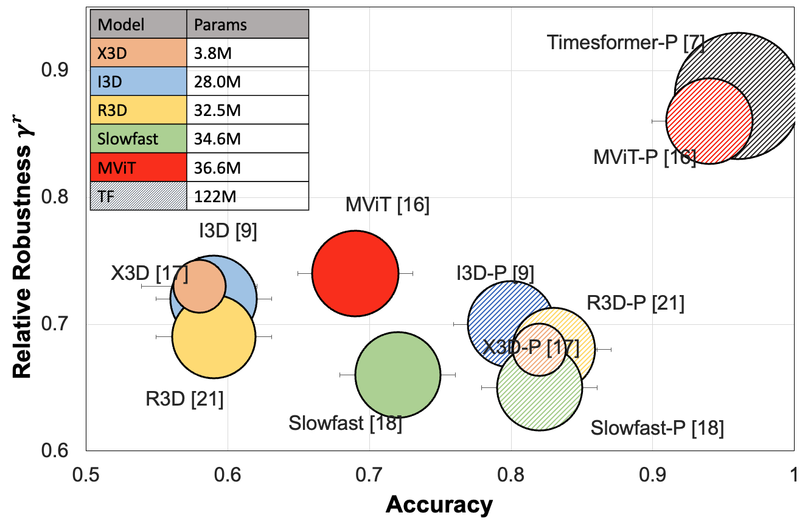

# Large-scale Robustness Analysis of Video Action Recognition Models
This repository is for [Large-scale Robustness Analysis of Video Action Recognition Models
](https://arxiv.org/abs/2207.01398) by [Madeline Chantry](https://sites.google.com/view/madelineschiappa/home), 
[Naman Biyani](https://arxiv.org/search/cs?searchtype=author&query=Biyani%2C+N), Prudvi Kamtam, 
[Shruti Vyas](https://arxiv.org/search/cs?searchtype=author&query=Vyas%2C+S), 
[Hamid Palangi](https://arxiv.org/search/cs?searchtype=author&query=Palangi%2C+H),
[Vibhav Vineet](https://arxiv.org/search/cs?searchtype=author&query=Vineet%2C+V),
and [Yogesh Singh Rawat](https://www.crcv.ucf.edu/person/rawat/).



# Introduction
In this work we perform a robustness analysis of existing state-of-the-art (SOTA) models for video action recognition.
We mainly focus on robustness against distribution shifts due to real-world perturbations instead of adversarial perturbations. 
In order to see if training on these distribution shifts improves performance, we trained on a variety of perturbations
(discussed in the [paper](https://arxiv.org/abs/2207.01398)) for UCF101. We additionally trained on a SOTA augmentation
method [PixMix](https://github.com/andyzoujm/pixmix). This code is used for training and evaluation of these models
with these different perturbations. 

# Setup
### Environment
In order to install the correct packages, we have provided an `environment.yml` for `conda` and a `requirements.txt` for
`pip`. If you are going to use `conda`, first edit the prefix filepath at the last line of `environment.yml` to where 
your local conda environments are stored. More information can be found in 
[Managing Conda Environments](https://conda.io/docs/user-guide/tasks/manage-environments.html).

### Data
The datasets required for this repository are [UCF101](https://www.crcv.ucf.edu/data/UCF101.php) and 
[SomethingSomethingv2 (SSv2)](https://developer.qualcomm.com/software/ai-datasets/something-something). 
Annotations for both datasets are located in `data/ucf101` and `data/ssv2`. 


# Contents
The bulk of the perturbation code is in `core`. Perturbation code is found in `core/video_perturb.py`.
Dataset annotations are in `data/`. 

# Usage
Below is an example script with annotations to explain each variable.
The models that are currently supported and their respective frames are:

| Model    | Model Var    | Num Frames |
|----------|--------------|------------|
| ResNet50 | resnet50     | 8          |
| I3D      | i3d_r50      | 8          |
| X3D      | x3d          | 16         |
| MViT     | mvit         | 16         |
| R3D      | r2d1         | 8          |
| SlowFast | slowfast_r50 | 32         |


```bash
PRETRAIN_PTH=torchhub  # This is if you are using the default weights from pytorchvideo, otherwise use own path
PRETRAIN_DATASET=kinetics400  # This is to set up the original linear classifier size
TYPE=ft  # This lets code know you are not training from scratch but loading pre-trained weights

TRAIN_DATASET=ssv2 # this is the dataset that you training/finetuning on, currently either ucf101 or ssv2
TRAIN_PATH=/home/schiappa/VideoRobustnessTraining/data/ssv2/train.csv  # Corresponding annotations
TEST_PATH=/home/schiappa/VideoRobustnessTraining/data/ssv2/test.csv  # Corresponding test annotations
ROOT_DIR=/home/c3-0/datasets/somethingsomething/videos/  # The root directory of the raw videos

MODEL=resnet50 # The model architecture you would like to train/test on
echo "Training resnet50 on SSv2"

# The outputpath is where all the results and weights will be stored.
OUTPUT_PATH=/home/schiappa/VideoRobustnessTraining/output/${MODEL}/${TYPE}_${TRAIN_DATASET}/${TRAIN_P}_3/save_last.pth

# This will run the script
python main.py $MODEL  \
                --pretrain_pth $PRETRAIN_PTH \ 
                --train_dataset $TRAIN_DATASET \
                --test_dataset $TRAIN_DATASET \
                --pretrain_dataset $PRETRAIN_DATASET \
                --train_path $TRAIN_PATH \
                --test_path $TEST_PATH \
                --root_dir $ROOT_DIR \
                --do_train \  # Add this flag if training
                --epochs 50 \
                --train_batch_size 32

# Iterate through test perturbations for evaluation
TEST_PERTURBATIONS="
temporal
spatial
pixmix
mixed
compression
defocus_blur
gaussian_noise
shot_noise
impulse_noise
rotate
static_rotate
speckle_noise
sampling
reverse_sampling
jumble
box_jumble
freeze
translate
"
PRETRAIN_DATASET=ucf101

# Now trained the model, the pretrained path is different and the pre-train dataset is the dataset trained on
PRETRAIN_PTH=/home/schiappa/VideoRobustnessTraining/output/${MODEL}/${TYPE}_${TRAIN_DATASET}/None_None/save_last.pth
for TEST_P in $TEST_PERTURBATIONS
do
    echo "Running testing for model ${PRETRAIN_PTH} for perturbation ${TEST_P}"
    python /home/schiappa/VideoRobustnessTraining/main.py $MODEL  \
                                                    --pretrain_pth $PRETRAIN_PTH \
                                                    --train_dataset $TRAIN_DATASET \
                                                    --test_dataset $TRAIN_DATASET \
                                                    --pretrain_dataset $TRAIN_DATASET \
                                                    --train_path $TRAIN_PATH \
                                                    --test_path $TEST_PATH \
                                                    --root_dir $ROOT_DIR \
                                                    --test_perturbation $TEST_P \
                                                    --test_severity 3
done
```

# Pretrained Models
| Model    |   Mixed $(\gamma^r)$ |   PixMix $(\gamma^r)$ |   Spatial $(\gamma^r)$ |   Temporal $(\gamma^r)$ |
|:---------|---------------------:|----------------------:|-----------------------:|------------------------:|
| MViT     |                 0.59 |                  0.29 |                   0.08 |                    0.21 |
| R2D1     |                 1.02 |                  0.37 |                   0.86 |                    1.16 |
| ResNet50 |                 1.06 |                  1.11 |                   1.16 |                    1.12 |
| X3D      |                 1.12 |                  0.98 |                   1.25 |                    0.9  |


In this case, we treat the model trained on pertrubed data as "clean": $\gamma^r_p = 1 - (A^{f}_p - A^{f_p}_p)/ A^{f_p}_p$

# UCF101-DS
To use UCF101-DS, first download the dataset from the 
[UCF webpage](https://www.crcv.ucf.edu/research/projects/ucf101-ds-action-recognition-for-real-world-distribution-shifts/)

# Citation
```bibtex
@inproceedings{robustness2022large,
title={Large-scale Robustness Analysis of Video Action Recognition Models},
author={Schiappa, Madeline C and Biyani, Naman and Kamtam, Prudvi and Vyas, Shruti and Palangi, Hamid and Vineet, Vibhav and Rawat, Yogesh},
booktitle={The IEEE/CVF Conference on Computer Vision and Pattern Recognition},
year={2023}
}
```
